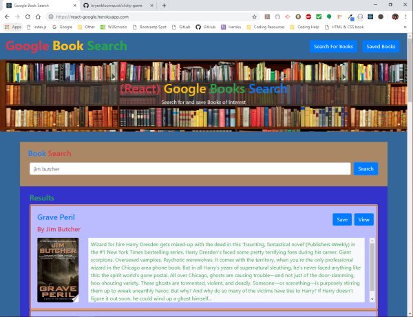
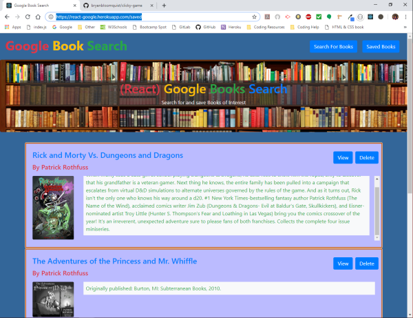

# Google Books Search

Deployed Site: [react-google.herokuapp.com](https://react-google.herokuapp.com)

## Overview

Google Books Search is a full stack application that searches Google for books.  This application uses React components, works with helper/util functions, and utilizes React lifecycle methods to query and display books based on user searches. Node, Express and MongoDB are used so that users can save books to review or purchase later.

## Search Page

* The user can search for books via the Google Books API and render the results on this page.  The user then has the option to "View" the book, which will bring them to the result on Google Books, or "Save" the book to the Mongo database for later.

## Saved Page

* This page renders all books saved to the Mongo database.  The user can then "Delete" the book if they no longer want it or "View" the book on Google Books.

